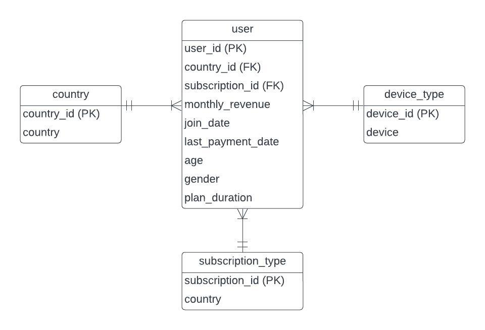

 # Case Study #1: Netflix Userbase 🍿

## Table Of Contents 
* [Introduction](#introduction) 
* [Data Wrangling](#data-wrangling)
* [Data Description](#data-description)
* [Entity Relationship Diagram](#entity-relationship-diagram)
* [SQL Analysis](#sql-analysis)


### Introduction
----


This analysis delves into the essential user attributes of Netflix, leveraging a publicly accessible dataset sourced from Kaggle. The dataset serves as a rich source of information, enabling data analysts to conduct a thorough examination of user behaviour, encompassing subscription trends and demographic details. The overarching goal is to better understand and address the unique requirements of Netflix users, ultimately contributing to an elevated and more personalized streaming experience. 

### Data Wrangling 
----
Simple data wrangling that includes data normalization conducted in **Jupyter Notebook**:

* checking nulls, profiling data, and ensuring data integrity
* explode the main table into database-like tables (data normalization) 
* dropping unnecessary columns

### Data Description 
----

* **User ID** = Unique Identifier for Netflix User
* **Subcription Type** = Netflix's subscription type (Basic, Standard, and Premium)
* **Monthly Revenue** = Monthly Sales generated based on type of subscription 
* **Join Date** = Date when User join subscription
* **Last Payment Date** = Date of the latest transaction for subscription
* **Country** = User's country
* **Age** = User's age
* **Gender** = User's gender
* **Device** = User's chosen streaming device

### Entity Relationship Diagram
----
 

### SQL Analysis
----
The querying process will be all conducted using SQL Server. 

For every challenge, a small table of querying results and steps is provided as part of practicing findings demonstration.

***1. Retrieve Netflix users' data that has joined before the beginning of 2022*** 🎆

```
SELECT 
	*
FROM 
	[dbo].[users]
WHERE
	join_date < '01-01-22' --without function
ORDER BY
    join_date ASC

SELECT 
	*
FROM 
	[dbo].[users]
WHERE 
	YEAR(join_date) < '2022' --with function
ORDER BY
	join_date ASC
```

**Steps:**

- Build the fundamental **SELECT** to retrieve all columns from <mark style="background-color: #f2f2f2">[dbo].[users]</mark>.
- Formulate **WHERE** clause to apply filter and fetch only rows within **join_date** column before year 2022.
- We are allowed to use **Operators** or **YEAR** function to fetch appropriate rows. Function, however, can cost more computational power.

**Answer:**
| user_id | monthly_revenue | join_date  | last_payment_date | age | gender | plan_duration | subscription_id | country_id | device_id |
|---------|-----------------|------------|-------------------|-----|--------|---------------|-----------------|------------|-----------|
| 2       | 15              | 5/09/2021  | 22/06/2023        | 35  | Female | 1 Month       | 1               | 1          | 1         |
| 48      | 12              | 15/09/2021 | 24/06/2023        | 32  | Male   | 1 Month       | 2               | 7          | 1         |
| 28      | 12              | 27/09/2021 | 24/06/2023        | 33  | Male   | 1 Month       | 2               | 7          | 1         |
| 58      | 12              | 8/10/2021  | 24/06/2023        | 34  | Male   | 1 Month       | 2               | 7          | 0         |
| 18      | 12              | 18/10/2021 | 24/06/2023        | 43  | Male   | 1 Month       | 2               | 7          | 0         |

* this is a sample of query result.


***2. Find and sort the busiest month of the year during the whole period in dataset*** 🏤

```
SELECT 
	MONTH(join_date) as month_of_the_year,
	COUNT(user_id) as total_new_subscribers
FROM
	[dbo].[users]
GROUP BY
	MONTH(join_date)
ORDER BY
	total_new_subscribers DESC
```

**Steps:**
- Similar to before, create the base **SELECT** clause. Then use **MONTH** function to fetch Month from **'join_date'** column and aliases it as **'month_of_the_year'**. 
- Use **COUNT** function to count the occurrences of **'user_id"** in the table and aliases it as **'total_new_subscribers'**
- Group the result using **'MONTH(join_date)'** just like in the first statement in **SELECT** clause.
- Sort the result set in descending order based on the **'total_new_subscribers'**

**Answer:**

| month_of_the_year 	| total_new_subscribers 	|   	
|-------------------	|-----------------------	|	
| 10                	| 524                   	|   	
| 7                 	| 481                   	|  
| 8                 	| 382                   	|   
| 9                 	| 370                   	|   	
| 11                	| 299                   	|   	
| 6                 	| 298                   	|   	
| 5                 	| 45                    	|   	
| 12                	| 26                    	|   	
| 4                 	| 24                    	|   	
| 1                 	| 20                    	|   	
| 3                 	| 19                    	|   	
* October was when the majority of current users joined, followed by July and August.

***3. Find the average users' age based on countries*** 🌎
``````
SELECT 
	co.country,
	AVG(age) as age_average
FROM 
	[dbo].[users] us
	JOIN
	[dbo].[countries] co
	ON
	us.country_id = co.country_id
GROUP BY
	co.country
``````

**Steps:**

- Call the appropriate column on **SELECT** clause - in this case, country and age. Then, use the aggregation function **AVG** to calculate the numeric average of age.
- Merge <mark style="background-color: #f2f2f2">[dbo].[users]</mark> and <mark style="background-color: #f2f2f2">[dbo].[country]</mark> tables  through process of **JOIN** clause and identification of key column to build table relationship.
- Group the result by non-aggregated column that sits on **SELECT** clause.

**Answer:**
| country        	| age_average 	|
|----------------	|-------------	|
| Australia      	| 38          	|
| Brazil         	| 38          	|
| Canada         	| 38          	|
| France         	| 39          	|
| Germany        	| 39          	|
| Italy          	| 38          	|
| Mexico         	| 38          	|
| Spain          	| 38          	|
| United Kingdom 	| 39          	|
| United States  	| 38          	|


* Apparently our query suggests that our users' age average across all countries are around the same age, 38-39.

***4. Find the largest userbase based on country*** 🌐

``````
WITH country_rank as ( 
	SELECT
		co.country as country,
		COUNT(us.user_id) as total_users,
		DENSE_RANK() OVER (ORDER BY COUNT(us.user_id) DESC) AS total_user_ranking
	FROM 
		[dbo].[users] us
		JOIN
		[dbo].[countries] co
		ON
		us.country_id = co.country_id
	GROUP BY
		co.country)
SELECT 
	country,
	total_users
FROM 
	country_rank
WHERE
	total_user_ranking = 1

``````
**Steps:**


- `Common Table Expression (CTE)`:
1. Inside CTE, normally use **SELECT** clause to call appropriate column/s, then use **COUNT** to calculate how many users spread across the countries.
2. Conjunction with window function are common in CTE. In this instance, I am using **DENSE_RANK** to rank the total users based on their country in descending order. Using **DENSE_RANK** instead of **ROW_NUMBER** allows me to have multiple variables under a single rank - which in this case, we have two countries with exact count of most users.
- `Outer Query`:
1. Use **SELECT** clause to select column from CTE and apply a filter using **WHERE** clause to fetch only row or rows where column **'total_user_ranking'** equals to 1.

**Answers:**

| country       	| total_users 	|
|---------------	|-------------	|
| Spain         	| 451         	|
| United States 	| 451         	| 	

* The highest concentration of our userbase is in Spain and the United States.

***5. Find countries with the lowest number of users*** 🗾

``````
 WITH total_num_users as (
	SELECT 
		co.country,
		COUNT(us.user_id) as total_users
	FROM 
		[dbo].[users] us
		JOIN
		[dbo].[countries] co
		ON 
		us.country_id = co.country_id
	GROUP BY
		co.country)

SELECT 
	country,
	total_users
FROM 
	total_num_users
WHERE
	total_users= (SELECT MIN(total_users) FROM total_num_users)
``````

**Steps:**
- This is just the alternative path for achieving the same result (although we are looking for different dataset) as the previous query. 
- CTE is still a big part of query, however, instead of using **DENSE_RANK** inside CTE, I am choosing subquery at the outer query to pull countries with lowest number of users. 
-  Using **MIN** and **CLAUSE** do the trick to find smallest userbase in our dataset.

***6. Which subscription type is the most popular option for users from each country?***🧾
``````
WITH rank_subs as (
	SELECT
		co.country,
		sub.subscription_type,
		COUNT(us.user_id) as total_users,
		DENSE_RANK() OVER(PARTITION BY co.country ORDER BY COUNT(us.user_id) DESC) as total_users_ranking
	FROM 
		[dbo].[users] us
		JOIN
		[dbo].[countries] co
		ON
		us.country_id = co.country_id
		JOIN
		[dbo].[subscription_types] sub
		ON
		us.subscription_id = sub.subscription_id
	GROUP BY
		co.country, sub.subscription_type)
SELECT 
	country,
	subscription_type as favorite_subscription,
	total_users
FROM 
	rank_subs
WHERE
	total_users_ranking = 1
ORDER BY
	total_users DESC
``````
**Steps:**
- Still in the similar situation, the only modification in this syntax is how **'PARTITION'** used to group the result set without rolling them up like **GROUP_BY** clause and used **DENSE_RANK** to rank them in a sorted manner.

**ANSWER:**
| country        	| favorite_subscription 	| total_users 	|
|----------------	|-----------------------	|-------------	|
| Spain          	| Premium               	| 212         	|
| United States  	| Basic                 	| 199         	|
| United Kingdom 	| Standard              	| 180         	|
| Mexico         	| Standard              	| 179         	|
| Italy          	| Basic                 	| 176         	|
| Germany        	| Basic                 	| 149         	|
| France         	| Premium               	| 147         	|
| Brazil         	| Basic                 	| 146         	|
| Canada         	| Basic                 	| 145         	|
| Australia      	| Premium               	| 101         	|

* it's safe to say that every country has their own favorite service. 

***7. Find the gender distribution of users for each country and what are their most mainstream streaming device*** 👩

``````
WITH gender_pattern as(	
	SELECT 
		co.country,
		us.gender,
		dev.device,
		SUM(monthly_revenue) as sales_revenue,
		AVG(age) as average_age,
		DENSE_RANK() OVER(PARTITION BY co.country, us.gender ORDER BY COUNT(us.user_id) DESC) as total_users_ranking
	FROM 
		[dbo].[users] us
		JOIN
		[dbo].[device_types] dev
		ON
		us.device_id = dev.device_id
		JOIN
		[dbo].[countries] co
		ON
		us.country_id = co.country_id
	GROUP BY
		co.country,
		us.gender,
		dev.device)

SELECT 
		country,
		gender,
		device as favorite_device,
		CONCAT('$' , sales_revenue) as revenue,
		average_age
FROM 
	gender_pattern
WHERE
	total_users_ranking = 1
``````

**Steps:**
- Still using the previous template, but in this one, our main object is gender distribution and their favorite device based on their country.
- So instead of joining two tables, we are now merging three tables at the same query.
- In the outer query, call the appropriate columns from CTE and use **CONCAT** to format revenue with '$' sign.

**Answer:**

| country        	| gender 	| favorite_device 	| revenue 	| average_age 	|
|----------------	|--------	|-----------------	|---------	|-------------	|
| Australia      	| Female 	| Smartphone      	| $345    	| 39          	|
| Australia      	| Male   	| Smartphone      	| $332    	| 37          	|
| Brazil         	| Female 	| Smartphone      	| $352    	| 40          	|
| Brazil         	| Male   	| Smartphone      	| $332    	| 36          	|
| Canada         	| Female 	| Tablet          	| $654    	| 38          	|
| Canada         	| Male   	| Tablet          	| $541    	| 38          	|
| Canada         	| Male   	| Smartphone      	| $538    	| 39          	|
| France         	| Female 	| Laptop          	| $383    	| 41          	|
| France         	| Male   	| Tablet          	| $352    	| 39          	|
| Germany        	| Female 	| Laptop          	| $321    	| 39          	|
| Germany        	| Male   	| Laptop          	| $455    	| 39          	|
| Italy          	| Female 	| Smart TV        	| $387    	| 38          	|
| Italy          	| Male   	| Laptop          	| $396    	| 38          	|
| Mexico         	| Female 	| Tablet          	| $302    	| 38          	|
| Mexico         	| Male   	| Tablet          	| $333    	| 38          	|
| Spain          	| Female 	| Tablet          	| $830    	| 39          	|
| Spain          	| Male   	| Smart TV        	| $781    	| 38          	|
| United Kingdom 	| Female 	| Tablet          	| $368    	| 37          	|
| United Kingdom 	| Male   	| Smartphone      	| $345    	| 40          	|
| United States  	| Female 	| Laptop          	| $848    	| 38          	|
| United States  	| Male   	| Tablet          	| $798    	| 38          	|

* By the look of it, some countries regardless of the gender a certain device is favoured upon while the other countries have diverse opinion.

***8. Find the 5 top most spending user in our dataset*** 💸
``````
SELECT TOP 10
	us.user_id,
	sub.subscription_type,
	us.join_date,
	DATEADD(dd, 28, us.last_payment_date) AS latest_date_of_membership,
	CONCAT(DATEDIFF(dd, us.join_date, DATEADD(dd, 28, us.last_payment_date)) / 28 , ' ', 'Months') AS membership_period,
	DATEDIFF(dd, us.join_date, DATEADD(dd, 28, us.last_payment_date)) / 28 * monthly_revenue  AS revenue_generated
FROM 
	[dbo].[users] us
	JOIN
	[dbo].[subscription_types] sub
	ON
	us.subscription_id = sub.subscription_id
ORDER BY
	revenue_generated DESC
``````

**Steps:**
- Call the relevant columns to fetch.
- Use **DATEADD** function to add extra one month (4 weeks/ 28 days) to last_payment_date as that will determine the last day as an active member if users' chose to not continue its membership and aliases it as latest_date_of_membership.
- Use **DATEDIFF** function to substract last_payment_of_membership and join_date by day.
- Divide it back by 28 to see how many months are the member has been an active member, and multiply it by **'monthly_revenue'** and we will get how much revenue generated from each user.
- Deploy **ORDER_BY** to sort the data descendingly and use **SELECT TOP 5** to cap our results to 5 rows.

**Answer:**
| user_id 	| subscription_type 	| join_date  	| latest_date_of_membership 	| membership_period 	| revenue_generated 	|
|---------	|-------------------	|------------	|---------------------------	|-------------------	|-------------------	|
| 2       	| Premium           	| 2021-09-05 	| 2023-07-20                	| 24 Months         	| 360               	|
| 117     	| Basic             	| 2021-10-30 	| 2023-07-21                	| 22 Months         	| 330               	|
| 87      	| Premium           	| 2021-12-28 	| 2023-07-21                	| 20 Months         	| 300               	|
| 48      	| Standard          	| 2021-09-15 	| 2023-07-22                	| 24 Months         	| 288               	|
| 66      	| Premium           	| 2022-01-30 	| 2023-07-25                	| 19 Months         	| 285               	|

**9. The marketing team is considering offering a discounted subscription price, 20% below the regular rate, to users under 23, and 30% to users above 45 who meet the standard or premium user criteria. To assess the potential impact on revenue, the finance team wants to analyze past revenue data before finalizing the decision.** 🤑

``````
WITH age_class AS (
	SELECT
		us.user_id,
		us.age,
		sub.subscription_type,
		us.monthly_revenue,
		CASE 
			WHEN us.age <= 23 AND (sub.subscription_type = 'Premium' OR sub.subscription_type = 'Standard') THEN us.monthly_revenue * 0.8
			WHEN us.age >= 45 AND (sub.subscription_type = 'Premium' OR sub.subscription_type = 'Standard') THEN us.monthly_revenue * 0.7
			ELSE us.monthly_revenue
		END new_monthly_revenue,
		DATEDIFF(dd, us.join_date, DATEADD(dd, 28, us.last_payment_date)) / 28 AS membership_period
	FROM 
		[dbo].[users] us
		JOIN
		[dbo].[subscription_types] sub
		ON
		us.subscription_id = sub.subscription_id),

	new_revenue as (
		SELECT 
			*,
			new_monthly_revenue * membership_period as new_total_revenue,
			monthly_revenue * membership_period as old_total_revenue
		FROM 
			age_class)
SELECT 
	SUM(new_total_revenue) - SUM(old_total_revenue) as financial_impact
FROM new_revenue
``````
**Steps:**
- In the first CTE, as usual, started off with **SELECT** clause to select relevant column that we can use for analysis. However, columns **'user_id', 'age', 'subscription_type'** are not a must as they are there only for manual checking.
- Use **CASE** statement to check whether a user are qualified to be part of marketing campaign.
- Use the old syntax to find membership length since joining.
- Open the second CTE, and utilize it as a medium to find the projected total sales and compare to the old one.
- Outer query is simply summing up both metrics and find the potential opportunity cost if the marketing campaign implemented.

**Answer:**
| financial_impact 	|
|------------------	|
| -17333.7         	|

* The opportunity cost will be $17,333


